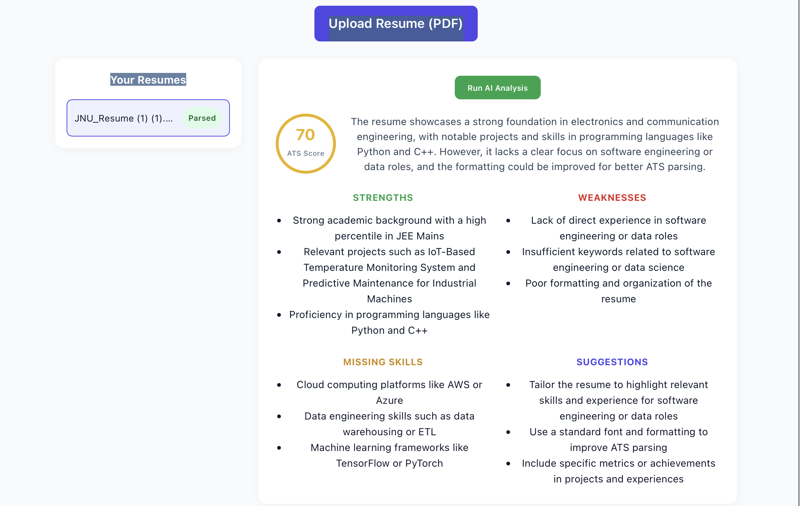

# AI Resume Analyzer

A full-stack application that lets users upload a resume (PDF), automatically
parses it, and runs an AI-powered analysis returning an ATS compatibility
score, strengths, weaknesses, missing skills, and concrete improvement
suggestions.



## Features

- 🔐 **JWT authentication** — register/login, protected routes
- 📄 **PDF parsing** — extracts resume text using `pdfplumber`
- 🤖 **AI analysis** — sends parsed text to an LLM (Groq/Llama 3.3, OpenAI-compatible)
  and returns structured JSON feedback
- 🗄️ **PostgreSQL** persistence via SQLAlchemy ORM
- 🐳 **Fully containerized** with Docker Compose (Postgres + backend)
- ⚛️ **React frontend** — upload UI, resume list, analysis dashboard

## Architecture
## Tech Stack

| Layer          | Technology                          |
|----------------|--------------------------------------|
| Backend        | FastAPI, Python 3.11                |
| Database       | PostgreSQL, SQLAlchemy ORM          |
| Auth           | JWT (python-jose), bcrypt hashing   |
| PDF Parsing    | pdfplumber                          |
| AI             | Groq API (Llama 3.3, OpenAI-compatible client) |
| Frontend       | React 18, Vite                      |
| Deployment     | Docker, Docker Compose              |

## Running Locally

### Prerequisites
- Docker Desktop
- Node.js 18+ (for the frontend)
- A free [Groq API key](https://console.groq.com/keys)

### 1. Clone and configure

```bash
git clone <your-repo-url>
cd resume-analyzer
cp .env.example .env
```

Edit `.env` and add your Groq API key and a JWT secret:
### 2. Start the backend + database

```bash
docker compose up --build
```

This starts Postgres and the FastAPI backend, wired together. The API will
be available at `http://localhost:8000` (interactive docs at `/docs`).

### 3. Start the frontend

```bash
cd frontend
npm install
npm run dev
```

Open the printed URL (typically `http://localhost:5173`).

### 4. Use the app

1. Register an account
2. Upload a resume PDF
3. Click "Run AI Analysis" to get ATS score + feedback

## API Endpoints

| Method | Endpoint                          | Description                     |
|--------|------------------------------------|----------------------------------|
| POST   | `/api/auth/register`              | Create an account                |
| POST   | `/api/auth/login`                 | Get a JWT access token           |
| GET    | `/api/auth/me`                    | Get current user (auth required) |
| POST   | `/api/resumes/upload`             | Upload + parse a PDF resume      |
| GET    | `/api/resumes/`                   | List your resumes                |
| GET    | `/api/resumes/{id}`               | Get resume detail + extracted text |
| POST   | `/api/resumes/{id}/analyze`       | Run AI analysis on a resume      |
| GET    | `/api/resumes/{id}/analyses`      | List past analyses for a resume  |

## Environment Variables

| Variable         | Description                                  |
|-------------------|-----------------------------------------------|
| `DATABASE_URL`    | Postgres connection string (set automatically by docker-compose) |
| `JWT_SECRET_KEY`  | Secret used to sign JWTs — use a long random string in production |
| `GROQ_API_KEY`    | API key for AI analysis (free tier at console.groq.com) |

## Notes / Future Improvements

- Move PDF parsing + AI analysis to a background task queue (Celery/RQ) for large files
- Add Alembic migrations instead of `create_all` for schema changes
- Add automated tests (pytest) and CI (GitHub Actions)
- Support OCR fallback for scanned/image-only PDFs
